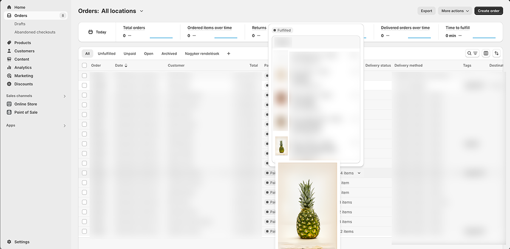

# 1. shopify-order-item-popup

## 1.1. Capability

This plugin enables users to display a larger version of a product image on Shopify's **Orders** page, when they open a popup with the list of
items for a specific order.
Enlarged image is automatically displayed on mouse hover, and removed, when user hovers elsewhere.

### 1.1.1. Techical details

Please note, that this plugin targets ***Polaris-PositionedOverlay*** type of objects for Shopify's items popup, and searches for 
divs with classes starting with ***_ThumbnailContainer*** for the location of thumbnail images.

If needed, this can be changed in the code accordingly.

### 1.1.2. Screenshot

### 1.1.3. Installation

- Install Tampermonkey plugin for your browser of choice
- In Tampermonkey plugin's settings, go to **Utilities/Import from URL**
- Specify the  file's URL, like: *https://github.com/DavidSutta/shopify-order-item-popup/raw/refs/heads/master/shopify-order-item-popup.user.js*
  - Alternatively, you can specify reference to a specific release tag 

